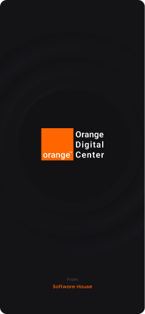
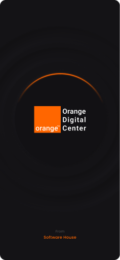
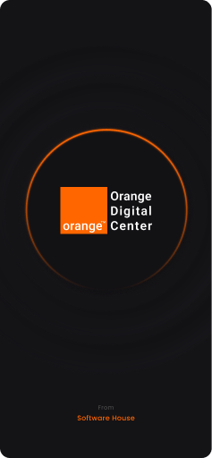
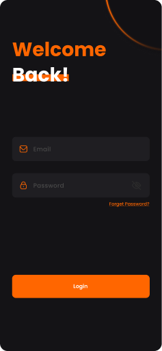
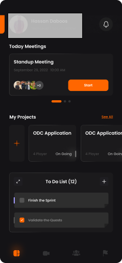
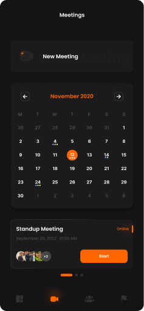

    <h1 align='center'><i>Orange Digital Center Management System App</i></h1>

<h2 style="display:inline">📝 Table of Contents</h2>

- [⛏️ Built With](#built-with)
- [🏁 Getting started](#getting-started)
- [📦 Packages used](#packages-used)
- [📷 Features](#features)
- [🔒 License](#license)

<h2 href="#built-with">⛏️ Built With : </h2>
 <ul>
    <li><a href="https://dart.dev/">Dart</a></li>
    <li><a href="https://flutter.dev/">Flutter</a></li>
 </ul>

<h2 href="#packages-used">📦 Packages used : </h2>
 <ul>
    <li> equatable:</li>
    <li>table_calendar:</li>
   <li>dashed_circular_progress_bar:</li>
   <li>flutter_launcher_icons:</li>
   <li>intl:</li>
   <li>flutter_svg:</li>
   <li>font_awesome_flutter:</li>
   <li>flutter_pw_validator:</li>
   <li>intl_phone_number_input:</li>
   <li>carousel_slider:</li>
   <li>google_fonts:</li>
   <li>shimmer:</li>
   <li>permission_handler:</li>
   <li>flutter_datetime_picker:</li>
   <li>dots_indicator:</li>
   <li>fluttertoast:</li>
   <li>flutter_screenutil:</li>
   <li>smooth_page_indicator:</li>
   <li>url_launcher:</li>
   <li>convex_bottom_bar:</li>
   <li>card_swiper:</li>
  <li>timeline_list: </li>
   <li>contained_tab_bar_view:</li>
   <li>easy_localization:</li>
   <li>flutter_windowmanager:</li>
   <li>geolocator:</li>
   <li>google_maps_flutter:</li>
   <li>bloc:</li>
   <li>flutter_bloc:</li>
   <li>path_provider:</li>
   <li>shared_preferences:</li>
   <li>dio:</li>
   <li>curl_logger_dio_interceptor:</li>
   <li>socket_io_client:</li>
   <li>sqflite:</li>
   <li>timezone: </li>
   <li>liquid_progress_indicator_v2:</li>
 </ul>

## 📷 Features

<h3 style="display:inline">
<strong><em>⚡️Splash Screens</em></strong></h3>

   
   
   
    

<h3 style="display:inline">
<strong><em>🔒 User Authentication</em></strong></h3>

   
   
   
   

<h3 style="display:inline">
<strong><em>🏠 DashBoard</em></strong></h3>

   

<h3 style="display:inline">
<strong><em>🤝🏻 Meetings </em></strong></h3>

   
   

<h3 style="display:inline">
<strong><em>🕖 Sprints </em></strong></h3>

   

<h3 style="display:inline">
<strong><em>👨‍💻👩‍💻👨‍💻👩‍💻 Teams </em></strong></h3>

   

<h2 href="#Contributors">✍️ Contributors</h2>
<table>
<tr>

## 🔒 License 

> This software is licensed under MIT License, See [License](https://github.com/CMP24-SWE-TEAM3/Backend/blob/main/LICENSE) .

